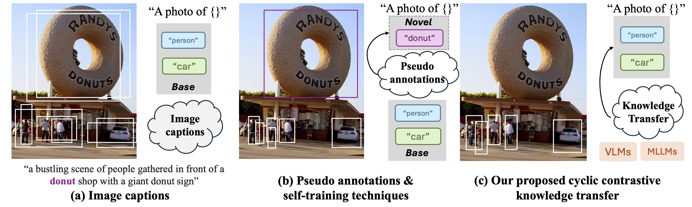

# Cyclic Contrastive Knowledge Transfer for Open-Vocabulary Object Detection

This repository contains the official code for [**CCKT-Det**](https://www.arxiv.org/abs/2503.11005), a novel approach to open-vocabulary object detection, accepted at ICLR 2025. Below, you'll find instructions for installation, data preparation, usage, and more! 🥳

  

## Installation ⚙️ 
Our models are developed with `python=3.9` and `pytorch=1.13.0`. Other versions might be available as well.

1. **Compile CUDA Operators**: Follow the instructions from [Deformable-DETR](https://github.com/fundamentalvision/Deformable-DETR) to compile CUDA operators.  
2. **Install Dependencies**: Install the required packages, including:  
   - [open-clip](https://github.com/mlfoundations/open_clip)  
   - `coco-api`  
   - `mmdet`  
   - `timm`  
   - `mmcv-full`

## Data Preparation 📦
For OVD-COCO setting, Please download [COCO2017](https://cocodataset.org/#home) dataset and follow [OV-DETR](https://github.com/yuhangzang/OV-DETR/tree/main) to split data into base and novel class.

For LVIS setting, follow the setup instructions from [ViLD](https://github.com/tensorflow/tpu/tree/master/models/official/detection/projects/vild).

The data file is organized as following:
```
data/
├── object365/
├── lvis/
    ├── lvis_v1_train_norare.json
    ├── lvis_v1_train_proposal.json
    └── instances_val2017_all.json
└── coco/
    ├── instances_train2017_base.json
    └── instances_val2017_all.json
└──regional_feats.pkl
```

## Usage 🚀 
> *The LATEST codebase is [here](https://github.com/ZCHUHan/cckt-det-mm).*

### Preprocessed Files 📁

The prior concepts file is available at [here](https://drive.google.com/drive/folders/12SWmtiMw793q04_nvq7JwPD1DXiCIfVD?usp=sharing).

### Evaluation 🔍
Evaluation can be done using:

```
CUDA_VISIBLE_DEVICES=0,1,2,3,4,5 python -m torch.distributed.launch --nproc_per_node=6 --use_env main.py --with_box_refine --resume outputs/checkpoint.pth --eval 
```

### Training 🏃‍♀️
1. **Extract Regional Features**: Generate `regional_feats.pkl` using:
```
python scripts/save_regional_feats.py
```
> *Note*: This process may take some time. Alternatively, download pre-extracted features [here](https://drive.google.com/file/d/1-Uj557TnZGPMTs9anmg7GHahUmLAvJyj/view?usp=sharing).

2. **Train the Model**: Use 6 GPUs with the provided script:
```
bash run_training.sh
```
Ensure regional_feats.pkl is in the coco_path/ directory before training.

## Citation ✍️
If you find this work useful, please cite our paper:
```
@article{zhang2025cyclic,
  title={Cyclic Contrastive Knowledge Transfer for Open-Vocabulary Object Detection},
  author={Zhang, Chuhan and Zhu, Chaoyang and Dong, Pingcheng and Chen, Long and Zhang, Dong},
  journal={arXiv preprint arXiv:2503.11005},
  year={2025}
}
```
